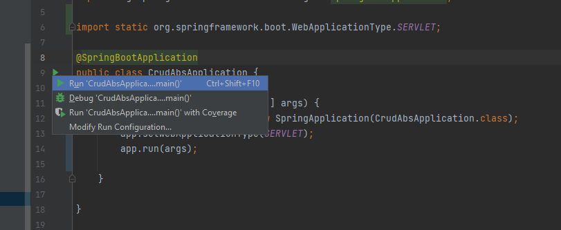
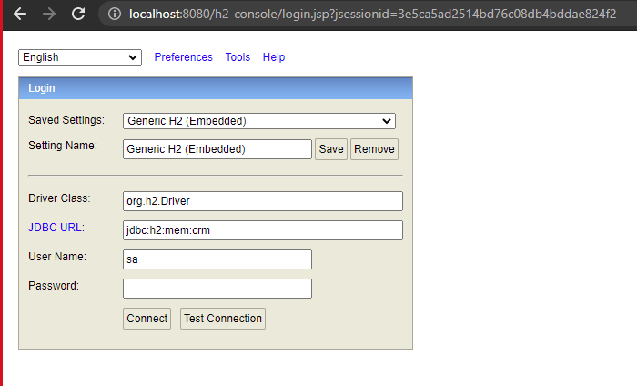

# CRUD-admin-book-store

# Pre-requisite
To build and run the project you will need the following tools and dependencies install on you operating system.

* Download and Install - Intellij latest version or any Java IDE.

* Download and Install - Java 8 SDK.

## Run the project
#### Go to `com/example/CRUDABS/CrudAbsApplication.java` and run the CrudAbsApplication starter.

click the button to run the application.

#### Goto H2 database write this on browser `http://localhost:8080/h2-console/`.

####Credentials on DB
* JDBC URL: jdbc:h2:mem:crm
* Username: sa
* Password: 

## API Documentation Link.

#### Postman

* https://www.getpostman.com/collections/b6fefadf4938325a5776

#### Swagger
* http://localhost:8080/swagger-ui.html#/